# 🌱 ShapeVillage

**ShapeVillage** is an **on-chain evolving world** where each **Village** is an NFT that owns its entire ecosystem of characters, lineage, and history. Instead of owning a static collectible, you own a **living, self-contained world** that grows over time.

---

## ✨ Key Idea

- Each **Village NFT** is a **container** that starts with a setting + two initial characters.
- You don’t upload art — you just **describe** your Village and founders.
- An **AI Agent** generates the **NFT image, traits, and metadata** for you.
- From there, characters **interact and evolve**, producing new descendants with shared traits.
- Owning a Village means you own:
  - The **land / setting**
  - The **founder characters**
  - All **descendants & their lineage**
  - The **future characters** yet to be born

Your Village NFT is a **self-contained, evolving economy** — richer histories and rarer evolutions make your Village more valuable to collectors.

---

## 🏗 How It Works

### FLOW

```mermaid
sequenceDiagram
  %% =========================
  %% ShapeVillage — Lifecycle
  %% =========================
  participant User
  participant GenesisAI as Genesis AI
  participant Factory as VillageFactory.sol
  participant Village as Village.sol (ERC‑721)
  participant CharAI as Character AI & Character.sol (ERC‑721)
  participant EvoAI as Evolution Engine

  %% Create Village
  User->>GenesisAI: Describe Village + Lore
  GenesisAI-->>User: Village image + metadata URI
  User->>Factory: createVillage(metadataURI)
  Factory->>Village: Deploy Village contract
  Village-->>User: Mint Village NFT (tokenId=1)

  %% Add initial two characters (description-only input)
  User->>CharAI: Describe Character #1 + Lore
  CharAI-->>Village: Char #1 image + metadata
  Village->>Village: addCharacter(...) → mint to Village custody

  User->>CharAI: Describe Character #2 + Lore
  CharAI-->>Village: Char #2 image + metadata
  Village->>Village: addCharacter(...) → mint to Village custody

  %% Ongoing autonomous evolution
  loop Periodic Evolution
    EvoAI->>Village: Read current traits/lineage
    EvoAI->>Village: spawn descendant with shared traits
    Village->>Village: mint new Character (owned by Village)
  end
```



### 1. Mint a Village

- Call the `VillageFactory` contract to create a new Village.
- Provide a simple description of your **Village + 2 initial characters**.

### 2. AI Agent Generates Metadata

- An off-chain **AI pipeline** transforms your description into:
  - NFT image
  - Metadata JSON (traits, story, rarity)
  - Lineage records

### 3. Village as Container

- Your Village NFT (ERC-721) automatically deploys its own **Village contract**.
- This contract:
  - Holds all characters (ERC-721 tokens)
  - Allows the owner to spawn new characters
  - Stores lineage and metadata

### 4. Character Evolution

- Once spawned, characters **interact periodically**.
- A backend agent simulates interaction between characters and **mints a new descendant** with shared traits.
- Descendants are owned by the **Village contract**, not by individuals.

### 5. Ownership & Trading

- **Transfer the Village NFT → transfer the entire ecosystem**.
- **Village Owner** can:

  - Sell characters individually (optional liquidity path)
  - Or sell the entire Village NFT, including its whole lineage

  ```mermaid
  flowchart LR
    User["👤 User"] -->|Owns| VillageNFT["🏡 Village NFT (ERC-721)"]
    VillageNFT -->|Owns| Characters["🧑‍🤝‍🧑 Character NFTs"]

    %% Trading options
    User -.->|Can sell entire Village| BuyerVillage["👤 Another User (buys Village)"]
    Characters -.->|Can be sold individually| BuyerChar["👤 Another User (buys Character)"]

  ```

---

## 🔮 Features

- **AI-Powered Genesis** → Just describe your Village, we generate the art + metadata.
- **On-Chain Lineage** → Each character tracks its parents + traits.
- **Evolving Ecosystem** → Villages produce new characters over time.
- **Self-Contained NFT Worlds** → Ownership = complete control of an ecosystem.
- **Trade Dynamics** → Sell a single character or flip the entire Village.
