# 🌱 ShapeVillage

**ShapeVillage** is an **on-chain evolving world** where each **Village** is an NFT that owns its entire ecosystem of characters, lineage, and history. Instead of owning a static collectible, you own a **living, self-contained world** that grows over time.


## 📑 Introduction

1. [🎥 Demo](#demo)  
2. [✨ Key Idea](#-key-idea)  
3. [🏗 How It Works](#-how-it-works)  
   - [1. Mint a Village](#1-mint-a-village)  
   - [2. AI Agent Generates Metadata](#2-ai-agent-generates-metadata)  
   - [3. Village as Container](#3-village-as-container)  
   - [4. Character Evolution](#4-character-evolution)  
   - [5. Ownership & Trading](#5-ownership--trading)  
   - [6. AI Interaction within each other](#6-ai-interaction-within-each-other)  
4. [🔮 Features](#-features)  
5. [🤖 AI Agents](#-ai-agents)  
6. [🛠 Smart Contract](#smart-contracts-overview)  
7. [🌍 Impact](#-impact)  
8. [🔮 Future Scope](#-future-scope)  
9. [🤝 Collaboration](#currently-developing-shapevillage--happy-to-collaborate)  


## Demo

click the thumbnail
[](https://youtu.be/pBBbcoEWKfc)

---

## ✨ Key Idea

- Each **Village NFT** is a **container** that starts with a setting + two initial characters.
- You don’t upload art — you just **describe** your Village and founders.
- An **AI Agent** generates the **NFT image, traits, and metadata** for you.
- From there, characters **interact and evolve**, producing new descendants with shared traits.
- Owning a Village means you own:
  - The **land / setting**
  - The **founder characters**
  - All **descendants & their lineage**
  - The **future characters** yet to be born

Your Village NFT is a **self-contained, evolving economy** — richer histories and rarer evolutions make your Village more valuable to collectors.

---

## 🏗 How It Works

### FLOW

```mermaid
sequenceDiagram
  %% =========================
  %% ShapeVillage — Lifecycle
  %% =========================
  participant User
  participant GenesisAI as Genesis AI
  participant Factory as VillageFactory.sol
  participant Village as Village.sol (ERC‑721)
  participant CharAI as Character AI & Character.sol (ERC‑721)
  participant EvoAI as Evolution Engine

  %% Create Village
  User->>GenesisAI: Describe Village + Lore
  GenesisAI-->>User: Village image + metadata URI
  User->>Factory: createVillage(metadataURI)
  Factory->>Village: Deploy Village contract
  Village-->>User: Mint Village NFT (tokenId=1)

  %% Add initial two characters (description-only input)
  User->>CharAI: Describe Character #1 + Lore
  CharAI-->>Village: Char #1 image + metadata
  Village->>Village: addCharacter(...) → mint to Village custody

  User->>CharAI: Describe Character #2 + Lore
  CharAI-->>Village: Char #2 image + metadata
  Village->>Village: addCharacter(...) → mint to Village custody

  %% Ongoing autonomous evolution
  loop Periodic Evolution
    EvoAI->>Village: Read current traits/lineage
    EvoAI->>Village: spawn descendant with shared traits
    Village->>Village: mint new Character (owned by Village)
  end
```



### 1. Mint a Village

- Call the `VillageFactory` contract to create a new Village.
- Provide a simple description of your **Village + 2 initial characters**.

### 2. AI Agent Generates Metadata

- An off-chain **AI pipeline** transforms your description into:
  - NFT image
  - Metadata JSON (traits, story, rarity)
  - Lineage records

### 3. Village as Container

- Your Village NFT (ERC-721) automatically deploys its own **Village contract**.
- This contract:
  - Holds all characters (ERC-721 tokens)
  - Allows the owner to spawn new characters
  - Stores lineage and metadata

### 4. Character Evolution

- Once spawned, characters **interact periodically**.
- A backend agent simulates interaction between characters and **mints a new descendant** with shared traits.
- Descendants are owned by the **Village contract**, not by individuals.

### 5. Ownership & Trading

- **Transfer the Village NFT → transfer the entire ecosystem**.
- **Village Owner** can:

  - Sell characters individually (optional liquidity path)
  - Or sell the entire Village NFT, including its whole lineage

  ```mermaid
  flowchart LR
    User["👤 User"] -->|Owns| VillageNFT["🏡 Village NFT (ERC-721)"]
    VillageNFT -->|Owns| Characters["🧑‍🤝‍🧑 Character NFTs"]

    %% Trading options
    User -.->|Can sell entire Village| BuyerVillage["👤 Another User (buys Village)"]
    Characters -.->|Can be sold individually| BuyerChar["👤 Another User (buys Character)"]

  ```
### 6. AI Interaction within each other

A dedicated function was built to simulate **AI characters interacting with each other** and producing new descendants.  
Due to limited AI credits, the system does not run fully autonomously yet — instead, you can manually trigger an interaction.

check [here](https://github.com/LeoFranklin015/shape-village/blob/master/backend/src/updateUserCharacter.ts)

**How to trigger character interaction:**

```bash
curl https://shape-village.onrender.com/api/interact/"your_address"
```
---

## 🔮 Features

- **AI-Powered Genesis** → Just describe your Village, we generate the art + metadata.
- **On-Chain Lineage** → Each character tracks its parents + traits.
- **Evolving Ecosystem** → Villages produce new characters over time.
- **Self-Contained NFT Worlds** → Ownership = complete control of an ecosystem.
- **Trade Dynamics** → Sell a single character or flip the entire Village.

## 🤖 AI Agents

ShapeVillage uses a trio of AI agents that bring Villages and their characters to life:

- **Genesis Agent** → Takes a simple text description of the Village and initial lore, then generates the **NFT image, metadata, and setting details**.  
- **Character AI** → Defines the **traits, personalities, and backstories** of the initial characters, enriching them with visual style and metadata.  
- **Evolution Engine** → Periodically simulates **interactions between characters** (e.g., cooperation, conflict, shared heritage), and automatically generates new descendants with combined traits.  

These agents are adaptive — they read **on-chain state** (e.g., which characters exist in a Village) and evolve outcomes accordingly, ensuring each Village ecosystem is unique and continuously growing.

---


## Smart Contracts Overview 
- **`VillageFactory.sol`** → Factory contract that deploys new Village contracts.  
- **`Village.sol`** → An ERC-721 contract representing the Village NFT. Acts as a **container and manager** for all characters within the Village.  
- **`Character.sol`** → ERC-721 contract for individual characters. Each character is minted into the custody of its Village by default.  

**Integration with Shape Primitives**  
- Designed for deployment to **Shape Mainnet**.  
- Will apply for **Gasback** incentives to reward early adopters and offset interaction costs.  

---
## 🌍 Impact

ShapeVillage creates new value for the Shape ecosystem in multiple ways:

- **Increases Engagement** → Users don’t just mint a static NFT; they participate in a *living, evolving world* that keeps them returning.  
- **AI x NFT Innovation** → Introduces a brand-new category of **self-contained, lineage-based NFTs** that grow over time.  
- **Cultural Resonance** → Encourages **storytelling, lore, and community-building**, where each Village becomes a cultural artifact with its own history and rare lineages.  

---
## 🔮 Future Scope

- **Deploy on Shape Mainnet** → Launch production contracts and apply for **Gasback incentives** to reward early adopters.  
- **Village Wars** → Introduce PvP mechanics where Villages can compete for resources, rare characters, or prestige.  
- **Marketplace Integration** → Enable **secondary sales** on OpenSea and other NFT marketplaces to increase liquidity for both Villages and individual Characters. 


🚧 Currently developing ShapeVillage — happy to collaborate!  
Reach me on **[x.com/LeoFranklin_15](https://x.com/LeoFranklin_15)**  
